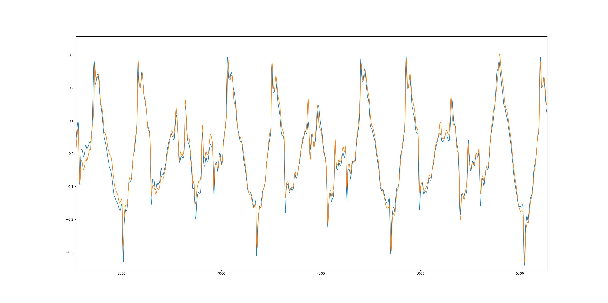

# Wavenet pytorch
Easy to read wavenet pytorch implementation, focusing on high gain amps.

Heavily inspired by https://github.com/sdatkinson/neural-amp-modeler

## About
Simple implementation of wavenet, and a standard convnet for audio amp capture.
This project focuses on high gain amps.

The training data consists of
* Input: DI guitar
    * Low threshold noise gate used to remove noise
* Output: Full amp rig
    * Full rig consists of gate, compressor, drive, amp, cab and EQ
    * Made using the AxeFX 2

## Audio examples
Input
* [Validation audio](audio/validation_DI.wav)

Output
* [Wavenet high gain](audio/model_output/wavenet_high_gain.wav)
* [Wavenet mid gain](audio/model_output/wavenet_mid_gain.wav)
* [Convnet high gain](audio/model_output/convnet_high_gain.wav)

More audio from experiments can be found here https://github.com/Will-J-Gale/wavenet-pytorch/tree/master/audio/model_output/experiments

## Test
```
python test.py
```
## Train
```
python train.py
```

_Wavenet result from 100 epochs of training_

## Wavenet builder
In the models folder there is a wavenet builder class to build different variations of wavenet.  

The parameters that can be tweaked are:
* Number of residual blocks
* Number of 'wavenet layers'
* Number of start convolution channels (subsequent layers are simply half the previous layer's channels)

